# *AI开发*

## 一、前置条件

### 1.1 开发端

| 设备   | 操作系统  |
| ------ | --------- |
| 个人PC | Win10 x64 |

> ❗必须要有显卡

### 1.2 运行端

| 设备   | 操作系统  |
| ------ | --------- |
| 个人PC | Win10 x64 |

> ❗必须要有显卡

### 1.3 所需软件

| 软件           | 版本       | 链接                                                         |
| -------------- | ---------- | ------------------------------------------------------------ |
| `Miniconda`    | `25.11.1`  | [下载地址](https://www.anaconda.com/download/success)        |
| `PyCharm`      | `2025.3.1` | [下载地址](https://www.jetbrains.com/pycharm/download/?section=windows) |
| `CUDA Toolkit` | `12.6`     | [下载地址](https://developer.nvidia.com/cuda-12-6-0-download-archive?target_os=Windows&target_arch=x86_64&target_version=10&target_type=exe_local) |

> ⚠️版本没有严格限制，一般默认最新版

### 1.4 所需技能

| 语言     | 程度 |
| -------- | ---- |
| `Python` | 熟悉 |

> ⚠️语言掌握程度无硬性要求，可以通过AI辅助编程，主要是要学会搭建环境

## 二、环境搭建

### 2.1 Miniconda配置

1. 通过[1.3小节](#1.3 所需软件)中的链接下载`Miniconda`安装包，并安装至`D:\dev\`目录下

   > 💡安装目录可自定义

   

   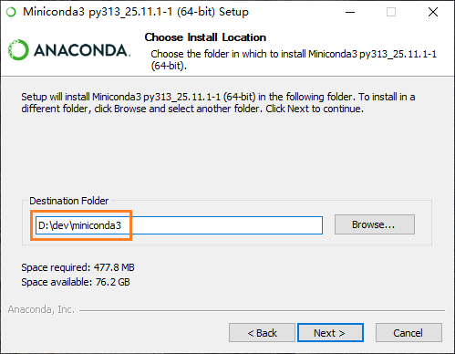

2. 设置`Miniconda`环境变量

   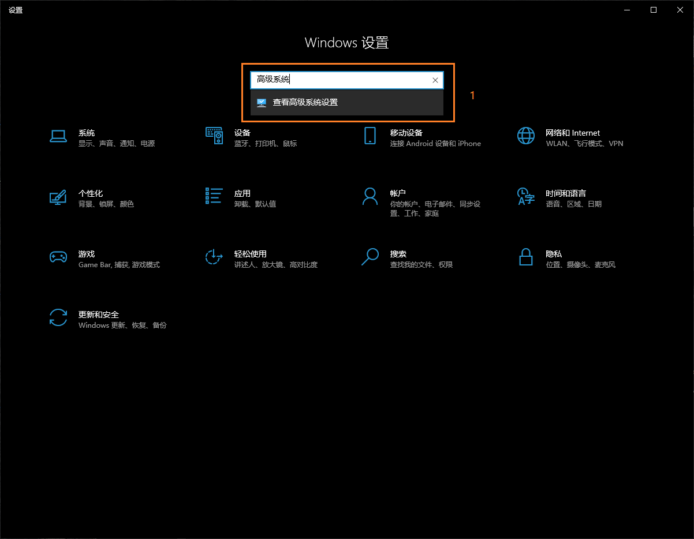

   

   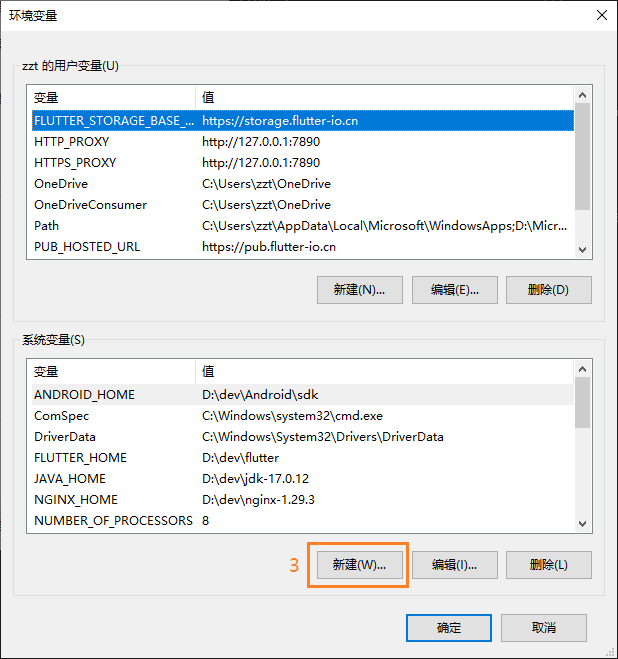

   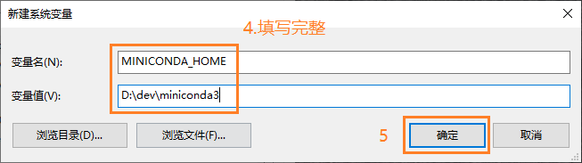

   

   

   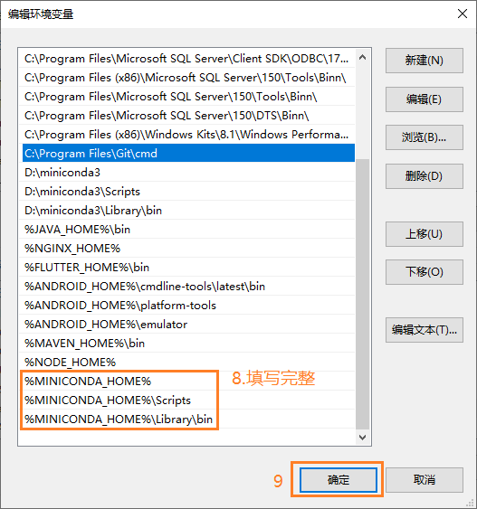

3. 在`CMD`中验证环境变量

   

4. 在`Anaconda PowerShell Prompt`中创建虚拟环境

   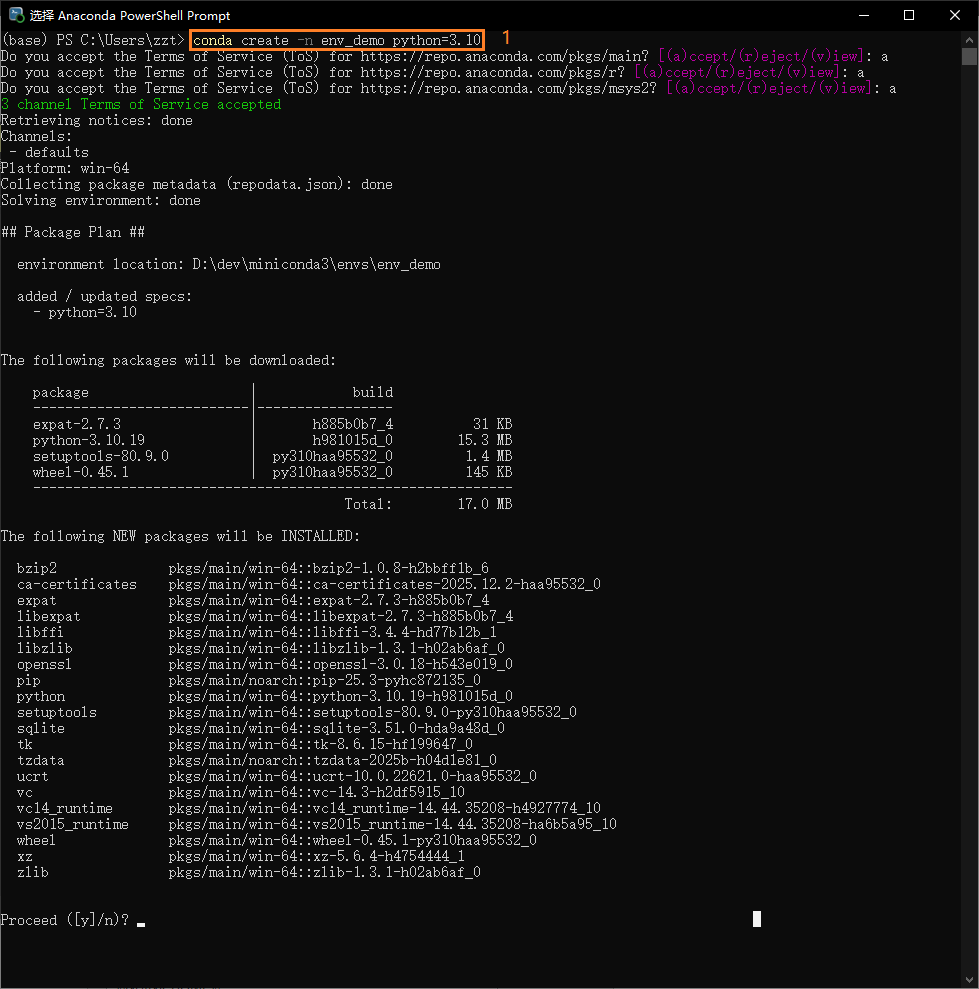

   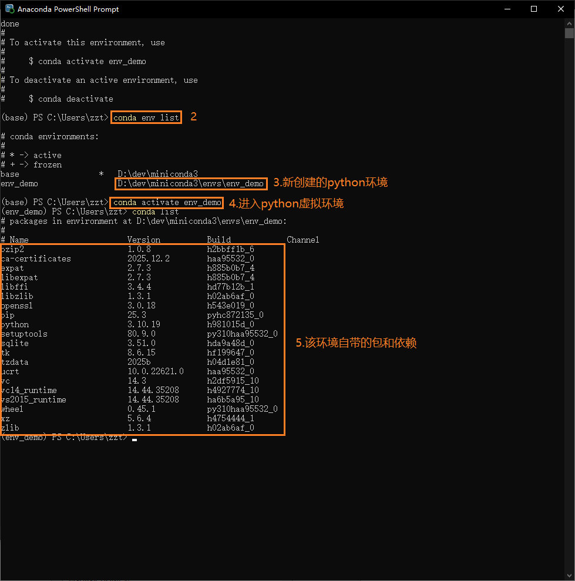

### 2.2 PyCharm配置

1. 通过[1.3小节](#1.3 所需软件)中的链接下载`PyCharm`安装包，并安装至`D:\dev\`目录下

   

2. 打开`PyCharm`，新建`D:\dev\project\ai\demo`项目，运行项目

   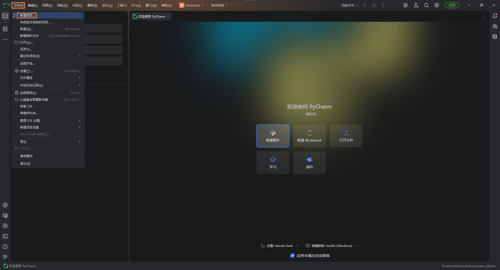

   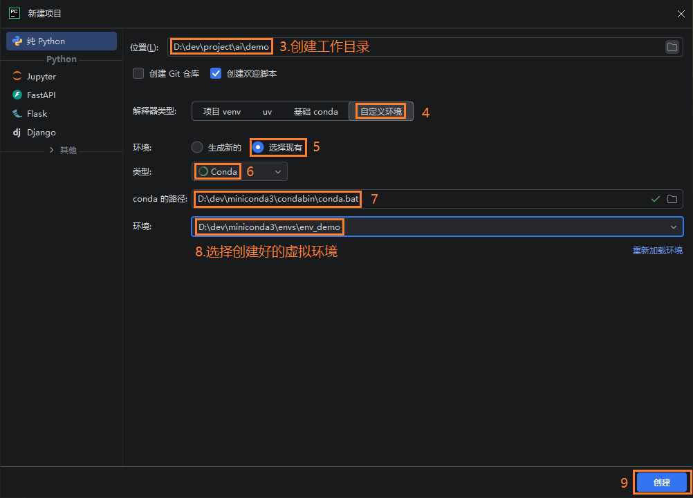

   

   

## 三、功能开发

### 3.1 PyTorch安装

1. 在`CMD`中输入`nvidia-smi`查看`CUDA`版本号

   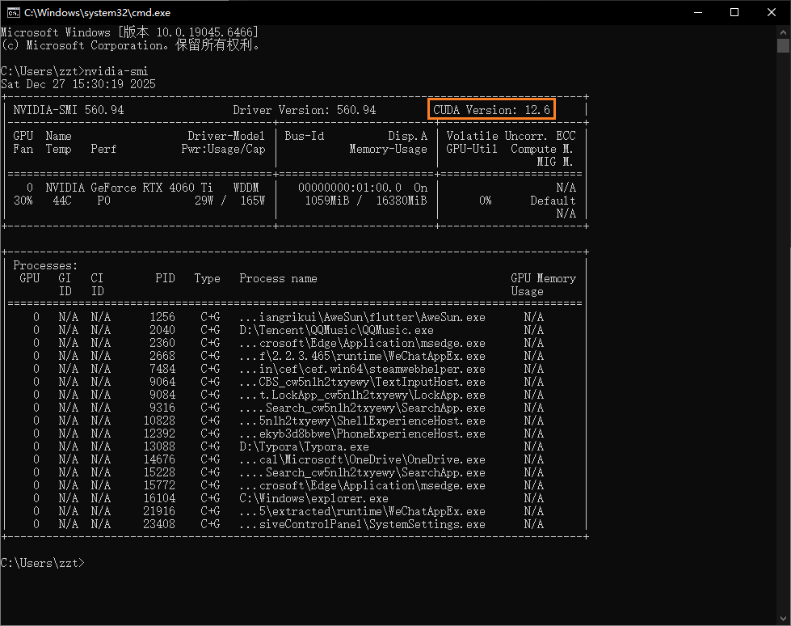

   > 💡只有安装了显卡驱动才能显示`CUDA`版本

2. 通过[1.3小节](#1.3 所需软件)中的链接下载`CUDA Toolkit`安装包，并安装至`D:\dev\cuda toolkit 12.6`目录下

   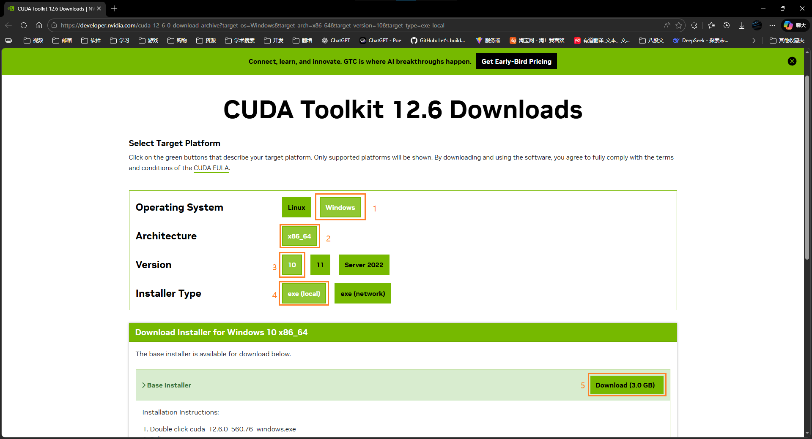

   > ❗`CUDA Toolkit`版本必须要小于`nvidia-smi`查询的`CUDA`版本号

3. 在`CMD`中验证`CUDA`是否成功安装

   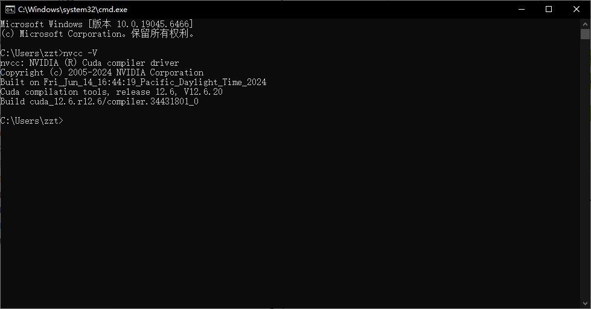

4. 在[PyTorch官网](https://pytorch.org/get-started/locally/)中获取`torch`安装命令

   

5. 通过`Anaconda PowerShell Prompt`进入`env_demo`虚拟环境，执行安装命令并验证

   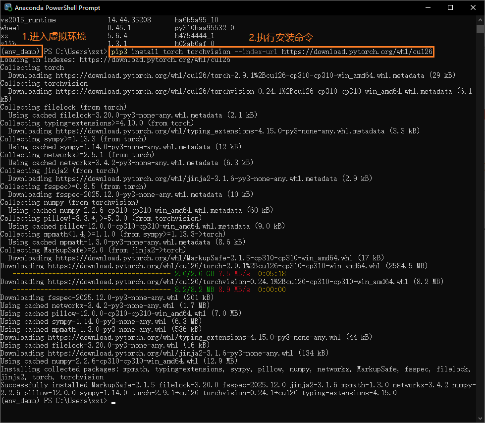

   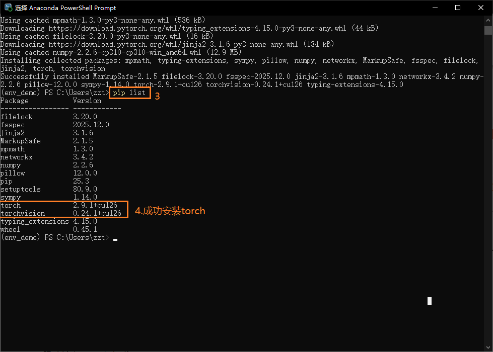

6. 在`PyCharm`中打开`D:\dev\project\ai\demo`项目，并添加部分代码

   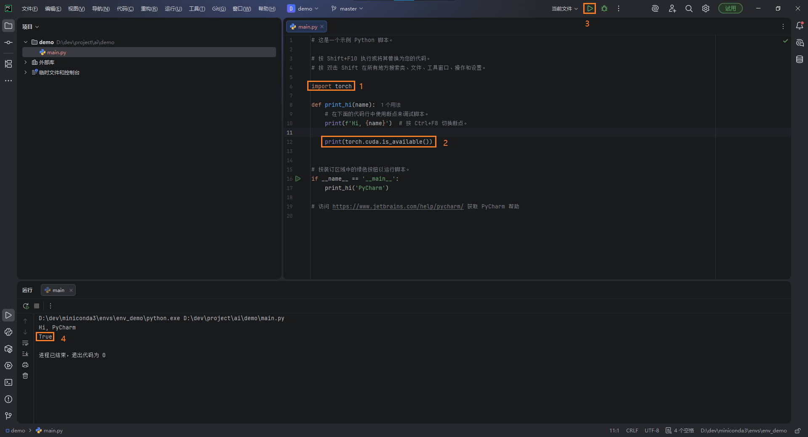

   ```python
   # 这是一个示例 Python 脚本。
   
   # 按 Shift+F10 执行或将其替换为您的代码。
   # 按 双击 Shift 在所有地方搜索类、文件、工具窗口、操作和设置。
   
   import torch
   
   def print_hi(name):
       # 在下面的代码行中使用断点来调试脚本。
       print(f'Hi, {name}')  # 按 Ctrl+F8 切换断点。
       print(torch.cuda.is_available())
   
   # 按装订区域中的绿色按钮以运行脚本。
   if __name__ == '__main__':
       print_hi('PyCharm')
   
   # 访问 https://www.jetbrains.com/help/pycharm/ 获取 PyCharm 帮助
   ```

### 3.2 ANN网络

#### 3.2.1 创建数据集

1. 在`D:\dev\project\ai\demo`项目下创建`data`文件夹，从[github](https://github.com/gtzitii/notes/blob/main/ai/demo/data/%E6%89%8B%E6%9C%BA%E4%BB%B7%E6%A0%BC%E9%A2%84%E6%B5%8B.csv)下载原始数据：`手机价格预测.csv`，并保存到`data`中

   

2. 在`PyCharm`中安装运行需要的第三方库，在终端中输入如下代码

   ```shell
   pip install pandas
   pip install scikit-learn
   pip install torchsummary
   ```

   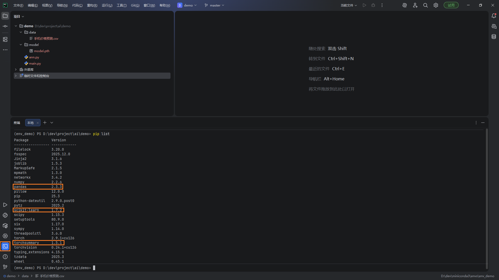

3. 在项目目录下新建`ann.py`脚本，并且导入相关的包

   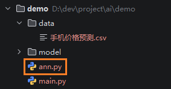

   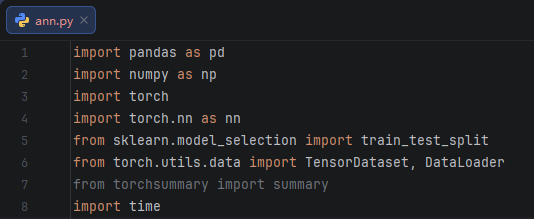

   ```python
   import pandas as pd
   import numpy as np
   import torch
   import torch.nn as nn
   from sklearn.model_selection import train_test_split
   from torch.utils.data import TensorDataset, DataLoader
   from torchsummary import summary
   import time
   ```

4. 在`ann.py`中定义函数用于创建数据集

   ```python
   #1. 创建数据集
   def create_dataset():
       #加载数据集
       data = pd.read_csv('data/手机价格预测.csv')#（2000，21）
       # print(f'data: {data.head()}')
       # print(f'data: {data.shape}')
   
       #获取x特征列和y标签列
       x,y = data.iloc[:,:-1],data.iloc[:,-1]#x大小为(2000,20),y大小为(2000,1)
       # print(f'x:{x.head()},{x.shape}')
       # print(f'y:{y.head()},{y.shape}')
   
       #将x转成浮点型
       x = x.astype(np.float32)
   
       #切分训练集和测试集
       x_train, x_test, y_train, y_test = train_test_split(
           x,y,
           test_size=0.2,
           random_state=42,
           shuffle=True
       )#x_train大小为（1600，20），x_test大小为（400，20），y_train大小为（1600，1），y_test大小为（400，1），
       # print(f'x:{x_train.head()},{x_train.shape}')
       # print(f'y:{y_train.head()},{y_train.shape}')
   
       #把数据集封装成张量数据集 思路：数据->张量tensor->数据集TensorDataset->数据加载器Dataloader
       train_dataset = TensorDataset(torch.tensor(x_train.values), torch.tensor(y_train.values))
       test_dataset = TensorDataset(torch.tensor(x_test.values), torch.tensor(y_test.values))
       # print(f':train_dataset:{train_dataset.data}')
       # print(f':test_dataset:{test_dataset}')
   
       # print(x.shape[1], len(np.unique(y)))
   
       return train_dataset, test_dataset, x.shape[1], len(np.unique(y))
   ```

#### 3.2.2 构建神经网络

在`ann.py`中定义网络模型类

```python
#2. 构建神经网络
class Model(nn.Module):
    def __init__(self, input_dim, output_dim):
        #初始化父类成员
        super().__init__()
        #搭建神经网络
        # 隐藏层1
        self.linear1 = nn.Linear(input_dim, 128)
        # 隐藏层2
        self.linear2 = nn.Linear(128, 256)
        # 隐藏层3
        self.linear3 = nn.Linear(256, 512)
        # 隐藏层4
        self.linear4 = nn.Linear(512, 256)
        # 隐藏层5
        self.linear5 = nn.Linear(256, 128)
        # 输出层
        self.output = nn.Linear(128, output_dim)

    #定义前向传播方法
    def forward(self, x):
        # 隐藏层1：加权求和+relu激活
        x = torch.relu(self.linear1(x))
        # 隐藏层2：加权求和+relu激活
        x = torch.relu(self.linear2(x))
        # 隐藏层3：加权求和+relu激活
        x = torch.relu(self.linear3(x))
        # 隐藏层4：加权求和+relu激活
        x = torch.relu(self.linear4(x))
        # 隐藏层5：加权求和+relu激活
        x = torch.relu(self.linear5(x))
        # 输出层：加权求和
        x = self.output(x)

        return x
```

#### 3.2.3 模型训练

1. 在项目目录下创建`model`文件夹用于保存模型参数

   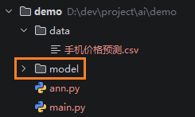

2. 在`ann.py`中定义模型训练函数

   ```python
   #3. 模型训练
   def train(train_dataset, input_dim, output_dim):
       #创建数据加载器
       train_loader = DataLoader(train_dataset, batch_size=16, shuffle=True)
       #创建网络模型
       model = Model(input_dim, output_dim)
       #定义损失函数
       criterion = nn.CrossEntropyLoss()
       #创建优化器
       optimizer = torch.optim.Adam(model.parameters(), lr=0.001)
       #定义训练轮数
       epochs = 500
       #开启多轮训练
       for epoch in range(epochs):
           #定义每次训练的损失值，训练批次数
           total_loss, batch_num = 0.0, 0
           #定义训练开始时间
           start = time.time()
           #开启一轮训练
           for x, y in train_loader:#x大小为(16,20)，y大小为(16,1)
               #切换到训练模式
               model.train()
               #模型预测
               y_pred = model(x)#y_pred大小为(16,4)
               #计算损失
               loss = criterion(y_pred, y)
               #梯度清零，方向传播，优化参数
               optimizer.zero_grad()
               loss.sum().backward()
               optimizer.step()
               total_loss += loss.item()
               batch_num += 1
           #打印训练信息
           print(f'epoch: {epoch+1}, loss: {total_loss/batch_num:.4f}, time: {time.time() - start:.2f}s')
       #训练结束，保存模型
       torch.save(model.state_dict(), 'model/model.pth')
   ```

3. 编写脚本训练模型并保存模型参数

   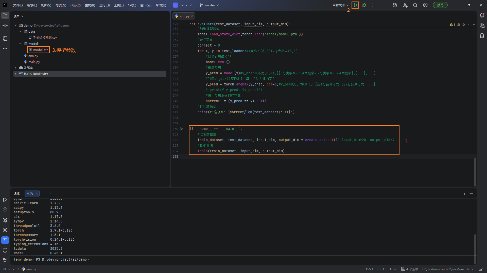

   ```python
   if __name__ == '__main__':
       #准备数据集
       train_dataset, test_dataset, input_dim, output_dim = create_dataset()# input_dim=20, output_dim=4
       #模型训练
       train(train_dataset, input_dim, output_dim)
   ```

#### 3.2.4 模型测试

1. 在`ann.py`中定义模型测试函数

   ```python
   #4. 模型测试
   def evaluate(test_dataset, input_dim, output_dim):
       #创建数据加载器
       test_loader = DataLoader(test_dataset, batch_size=8, shuffle=False)
       #创建网络模型
       model = Model(input_dim, output_dim)# input_dim=20,output_dim=4
       #加载模型参数
       model.load_state_dict(torch.load('model/model.pth'))
       #定义变量
       correct = 0
       for x, y in test_loader:#x大小为(8,20)，y大小为(8,1)
           #切换到测试模型
           model.eval()
           #模型预测
           y_pred = model(x)#y_pred大小为(8,4),[[0分类概率，1分类概率，2分类概率，3分类概率],[...],...]
           #利用argmax()获取8行中每一行最大值的索引
           y_pred = torch.argmax(y_pred, dim=1)#y_pred大小为(8,1),[第1行预测分类，第2行预测分类，...]
           # print(f'y_pred: {y_pred}')
           #统计预测正确的样本数
           correct += (y_pred == y).sum()
       #打印准确率
       print(f'准确率: {correct/len(test_dataset):.4f}')
   ```

2. 编写脚本加载模型参数，并测试模型的预测准确率

   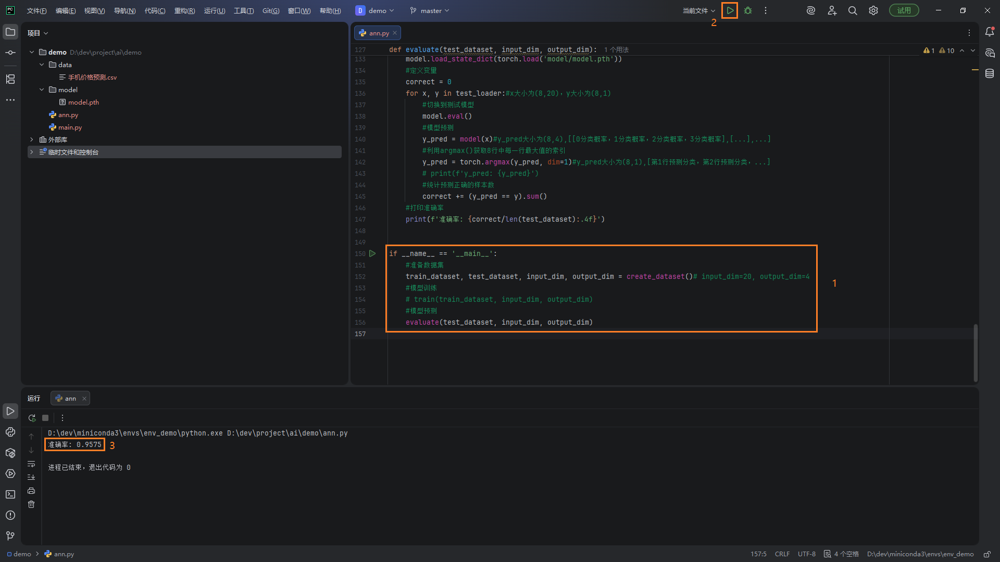

   ```python
   if __name__ == '__main__':
       #准备数据集
       train_dataset, test_dataset, input_dim, output_dim = create_dataset()# input_dim=20, output_dim=4
       #模型训练
       # train(train_dataset, input_dim, output_dim)
       #模型预测
       evaluate(test_dataset, input_dim, output_dim)
   ```

   > 💡提高模型预测准确率的方法
   >
   > ```python
   > # 1.优化方法从SGD->Adam
   > # 2.学习率从0.001->0.0001
   > # 3.对数据进行标准化
   > # 4.增加网络深度，每层的神经元数量
   > # 5.增加训练轮数
   > ```

### 3.3 CNN网络

### 3.4 RNN网络


## 四、打包部署

