# *Android移动App开发（基于flutter）*

## 一、前置条件

### 1.1 开发端

| 设备   | 操作系统  |
| ------ | --------- |
| 个人PC | Win10 x64 |

> ⚠️最好带有显卡

### 1.2 运行端

| 设备                | 操作系统        |
| ------------------- | --------------- |
| Xiaomi Pad 6 Max 14 | MIUI Pad 14.0.6 |

> ⚠️安卓设备最好不要华为或者荣耀

### 1.3 所需软件

| 软件             | 版本        | 链接                                                      |
| ---------------- | ----------- | --------------------------------------------------------- |
| `Android Studio` | `2025.2.27` | [下载地址](https://developer.android.google.cn/?hl=zh-cn) |
| `flutter`        | `3.38.4`    | [下载地址](https://docs.flutter.cn/install/manual)        |
| `VS Code`        | `1.106.3`   | [下载地址](https://code.visualstudio.com/)                |

> ⚠️版本没有严格限制，一般默认最新版

## 二、环境搭建

### 2.1 Android Studio配置

1. 通过[1.3小节](#1.3 所需软件)中的链接下载`Android Studio`安装包，并安装至`D:\dev\Android`目录下

   > 💡安装目录可自定义

2. 在`D:\dev\Android`目录下新建`sdk`文件夹，打开`Android Studio`，第一次打开会提示没有sdk，按提示安装sdk即可

   

3. 初始安装的sdk包括：`platforms`，`platform-tools`，`build-tools`，还需要安装另外一个sdk工具包：`Command-line tools`

   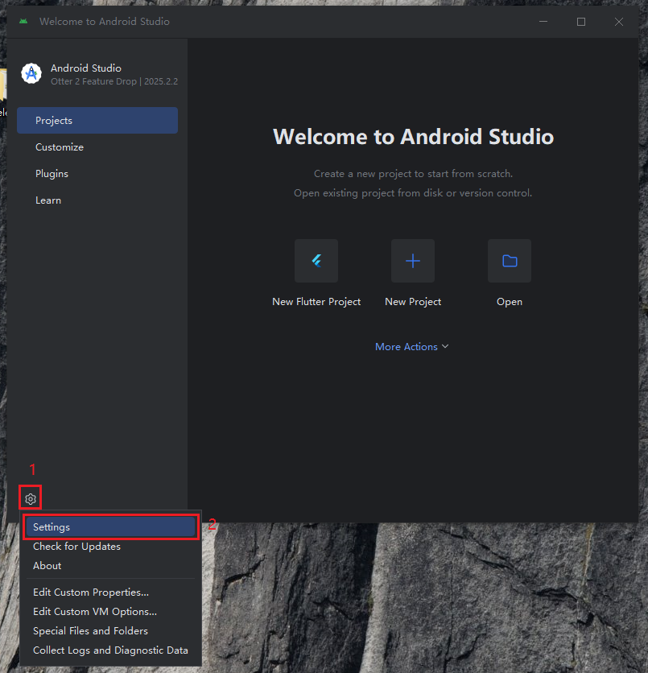

   

4. 安装安卓模拟器并启动

   

   

   

   

   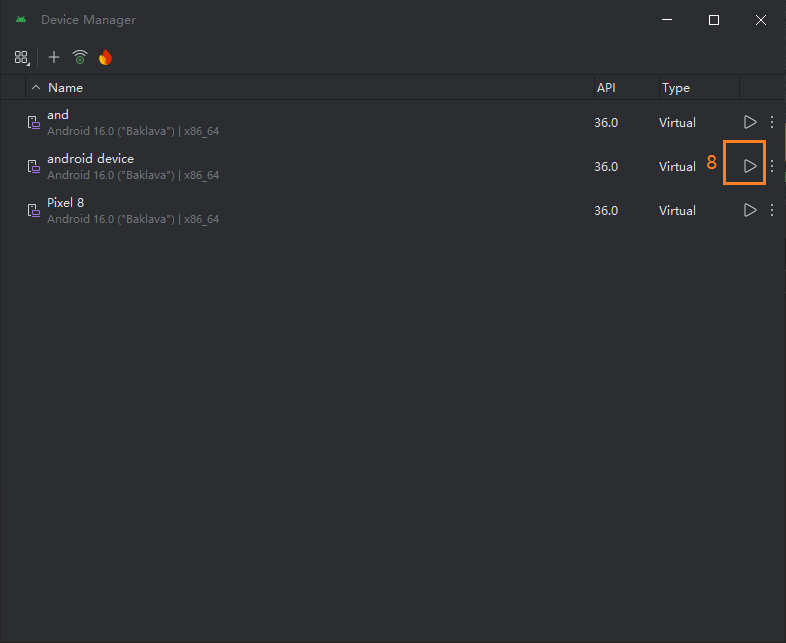

   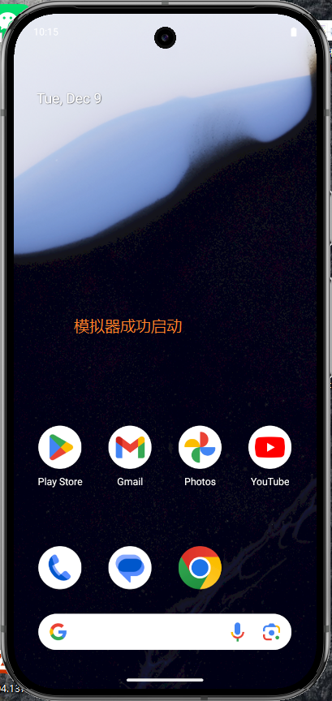

5. 设置安卓相关环境变量

   

   

   

   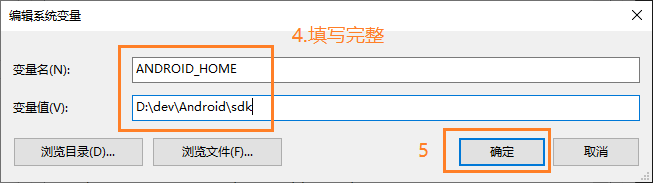

   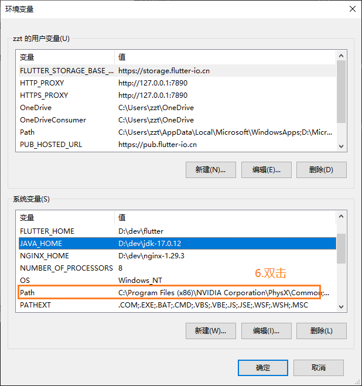

   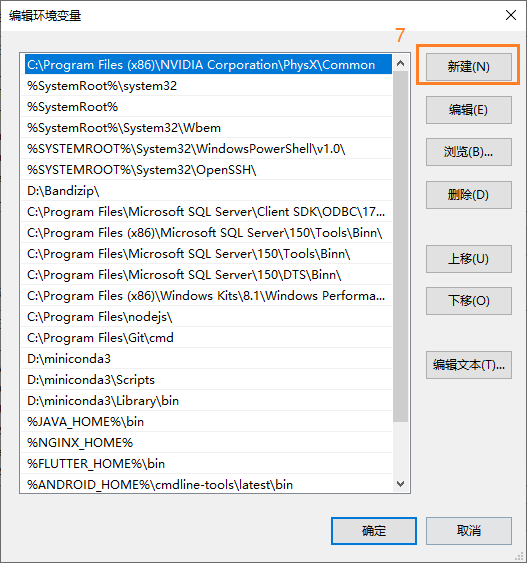

   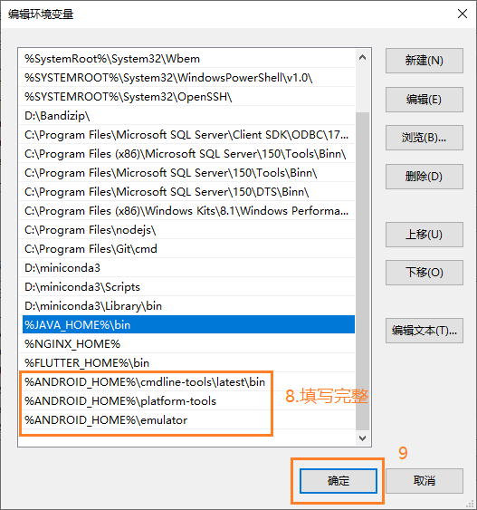

6. 进入`CMD`验证环境变量

   

### 2.2 flutter配置

1. 通过[1.3小节](#1.3 所需软件)中的链接下载``flutter``压缩包，并解压至`D:\dev`目录下

2. 设置flutter环境变量，方式同[2.1小节](#2.1 Android Studio相关配置)第5步一致

   

   

3. 验证环境变量

   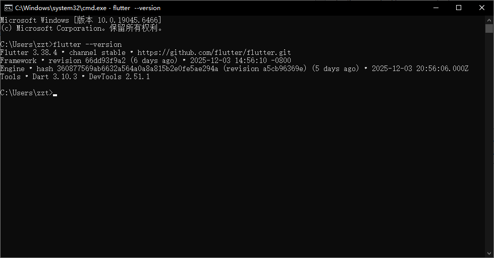

4. `flutter`添加安卓许可协议

   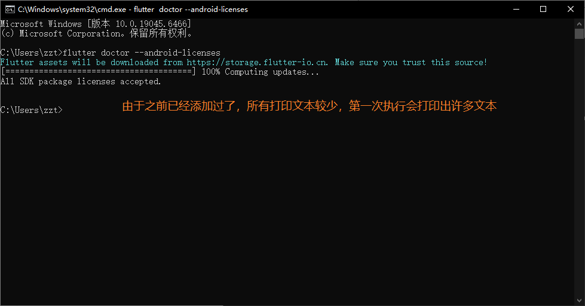

5. `flutter`验证安卓开发环境

   

### 2.3 项目环境配置 

1. 创建工作目录`D:\dev\project\app_flutter`，并从该目录进入`CMD`，在`CMD`中输入`flutter create demo`

   >💡demo是项目名称，可自定义

2. 通过[1.3小节](#1.3 所需软件)中的链接下载`VS Code`安装包，并安装至`D:\dev`目录下

   > 💡安装目录可自定义

3. 在`VS Code`中打开`D:\dev\project\app_flutter\demo`，项目结构如图，包含源码以及各个平台代码

   

4. 安装开发所需插件

   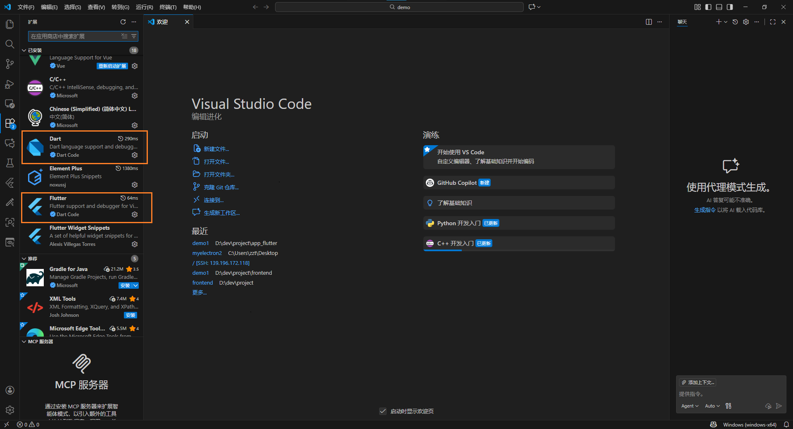

5. 修改android文件夹中的文件内容

   

   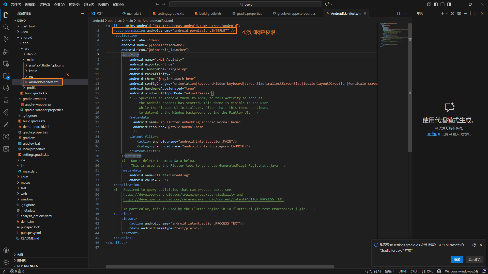

   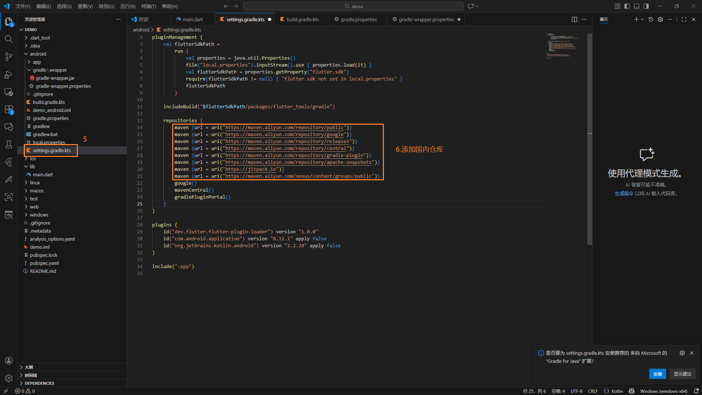

   > 💡修改完要保存

6. 在`VS Code`中启动模拟器

   

   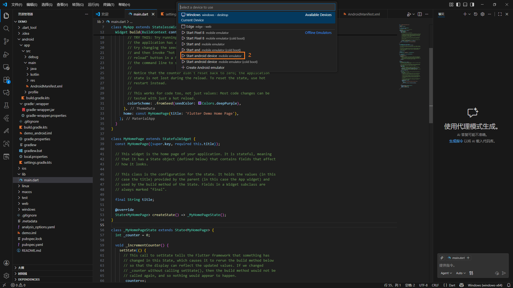

7. 在`VS Code`中打开终端，输入`flutter run`，将项目运行到模拟器中

   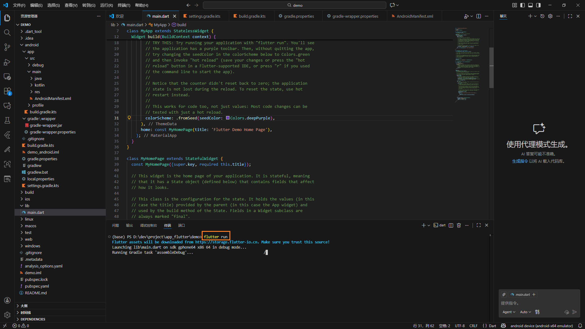

   

8. 到此，项目的基本环境已配置完成

   > ⚠️安卓模拟器功能受限，而且没有硬件环境，最好是有真机进行调试

### 2.4 真机调试

1. 准备[1.2小节](#1.2 运行端)中的`Xiaomi Pad 6 Max 14`安卓机，并开启开发者模式和USB调试

   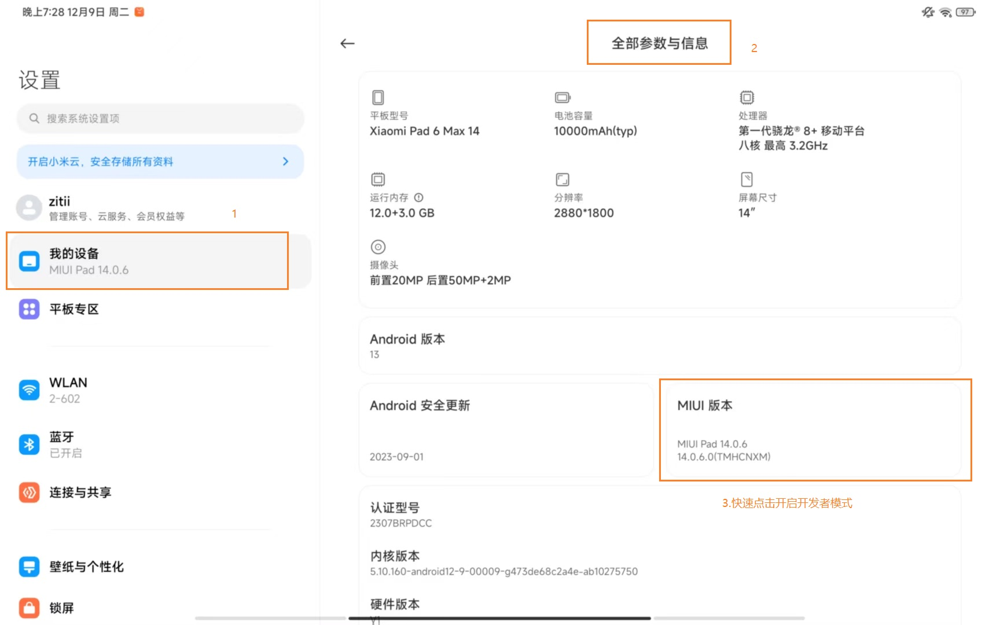

   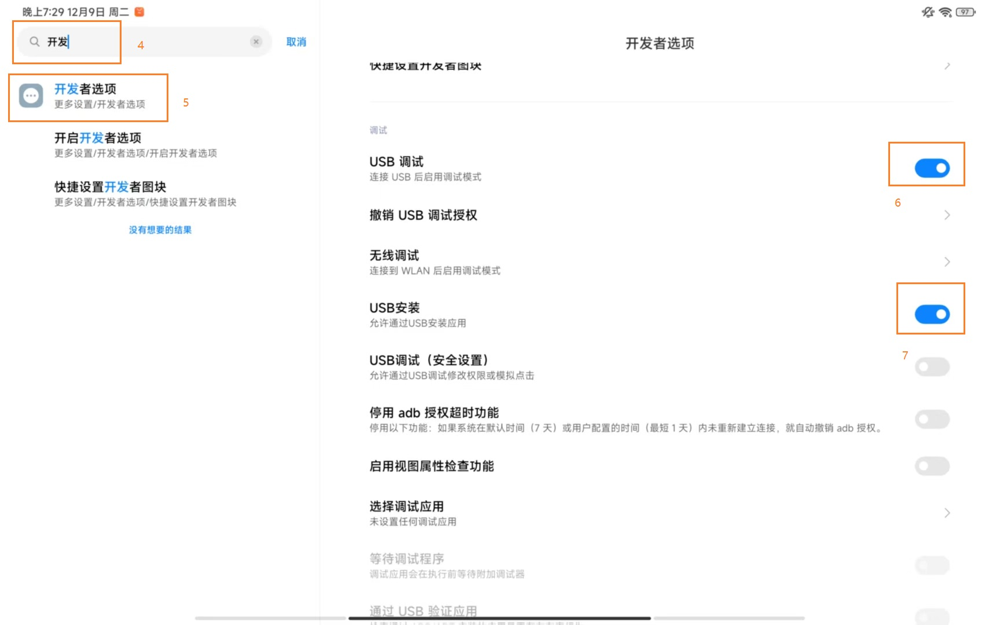

2. 通过USB线连接开发端和运行端，并在`CMD`中输入`adb devices`验证

   

   

3. 在`VS Code`中切换设备，并在终端输入`flutter run`，将项目打包成`apk`并安装到真机，需要在真机上确认安装

   

   

   

   > 💡真机调试过程中支持热重载，`VS Code`编辑完代码并保存后在终端输入`r`即可

## 三、功能开发

## 四、打包部署

