# Web开发

## 一、前置条件

### 1.1 开发端

| 设备   | 操作系统  |
| ------ | --------- |
| 个人PC | Win10 x64 |

> ⚠️最好带有显卡

### 1.2 运行端

| 设备         | 操作系统 |
| ------------ | -------- |
| 阿里云服务器 | ubuntu   |

> ⚠️服务器要能提供公网IP

### 1.3 所需软件

| 软件      | 版本       | 链接                                                         |
| --------- | ---------- | ------------------------------------------------------------ |
| `idea`    | `2025.2.5` | [下载地址](https://www.jetbrains.com/zh-cn/idea/download/?section=windows) |
| `node.js` | `24.11.1`  | [下载地址](https://nodejs.org/zh-cn/download)                |
| `VS Code` | `1.106.3`  | [下载地址](https://code.visualstudio.com/)                   |
| `Maven`   | `3.9.11`   | [下载地址](https://maven.apache.org/)                        |
| `jdk`     | `17.0.12`  | [下载地址](https://www.oracle.com/java/technologies/javase/jdk17-archive-downloads.html) |
| `git`     | `2.52.0`   | [下载地址](https://git-scm.com/)                             |

> ⚠️版本没有严格限制，一般默认最新版

### 1.4 所需技能

| 语言         | 程度 |
| ------------ | ---- |
| `HTML`       | 了解 |
| `CSS`        | 了解 |
| `JavaScript` | 熟悉 |
| `Java`       | 熟悉 |

> ⚠️语言掌握程度无硬性要求，可以通过AI辅助编程，主要是要学会搭建环境

## 二、环境搭建

### 2.1 前端环境配置

#### 2.1.1 node.js安装

1. 通过[1.3小节](#1.3 所需软件)提供的链接下载`node.js`压缩包，并解压至`D:\dev\`目录下

   > 💡安装目录可自定义

   

2. 添加`node.js`环境变量

   

   

   

   

   

   

   

3. 在`CMD`中验证环境变量

   

#### 2.1.2 项目配置

1. 创建工作目录`D:\dev\project\web`，并从该目录进入`CMD`，在`CMD`中输入`npm init vite@latest`，用`vite`脚手架构建项目，项目名称为`demo_frontend`，框架为`Vue`，语言为`JavaScript`

   

   > 💡项目名称可自定义，`CMD`中的警告信息不用理会，因为我加了一些其他配置

2. 通过[1.3小节](#1.3 所需软件)中的链接下载`VS Code`安装包，并安装至`D:\dev\`目录下

   > 💡安装目录可自定义

3. 在`VS Code`中打开`D:\dev\project\web\demo`，项目结构如图

   

4. 安装开发所需插件

   

5. 打开终端，输入`npm install`安装模块，安装完成后会在项目目录中自动添加`node_modules`文件夹，里面包含前端运行的各种库函数

   

6. 在终端输入`npm run dev`启动`vite`服务器，并通过浏览器加载前端页面

   

   

   > 💡服务器不是硬件机器，其实就是一段监听程序，在监听电脑中的某个端口，一旦有网络请求到达该端口，程序就负责处理请求

### 2.2 后端环境配置

#### 2.2.1 Maven安装

1. 通过[1.3小节](#1.3 所需软件)提供的链接下载`Maven`压缩包，并安装至`D:\dev\`目录下

   

2. 设置maven环境变量，方式同[2.1.1小节](#2.1.1 node.js安装)第2步一致

   

   

   

3. 在`Maven`根目录`D:\dev\apache-maven-3.9.11\`创建`repo`文件夹，用于保存依赖

#### 2.2.2 jdk安装

1. 通过[1.3小节](#1.3 所需软件)提供的链接下载`jdk`压缩包，并安装至`D:\dev\`目录下

   

2. 设置jdk环境变量，方式同[2.1.1小节](#2.1.1 node.js安装)第2步一致

   

   

   

#### 2.2.3 idea安装与配置

1. 通过[1.3小节](#1.3 所需软件)提供的链接下载`idea`安装包，并安装至`D:\dev\`目录下

   > ⚠️idea不要下载社区版，社区版没有spring框架

2. 打开`idea`，设置全局环境

   

   

   

   

3. 创建工作目录`D:\dev\project\web`，通过`idea`在该目录下创建`spring`项目

   

   

   

   

   

   

   > 💡目录结构中的文件颜色为红色，表示未被git追踪，对项目运行无影响

4. 运行`springboot`后端项目

   

   

   > 💡spring自带Tomcat服务器

   

### 2.3 前后端联调

1. 在`VS Code`中打开前端项目，添加一些用于联调的代码，并启动项目

   

   

   > ✅代码如下，修改完要保存

   ```javascript
   import axios from 'axios'
   import { ref } from 'vue'
   
   const text = ref('')  // 用来保存后端返回的数据
   const visitToBackend = async () => {
     try {
       const res = await axios.get('http://localhost:8080')
       text.value = res.data   // 更新显示
     } catch (error) {
       console.error('Error fetching data from backend:', error)
       text.value = '请求失败'
     }
   }
   ```

   ```html
     <!-- 点击按钮访问后端 -->
     <button @click="visitToBackend">访问后端</button>
   
     <!-- 展示后端返回的数据 -->
     <input v-model="text" />
   ```

   

   > ❗在点击`访问后端`按钮之前，需要保证[2.2.3小节](#2.2.3 idea安装与配置)的后端服务器已开启

2. 修改后端代码，并重启服务器

   

3. 前端成功访问到后端

   

## 三、功能开发

## 四、远程部署

### 4.1 远程主机配置

1. 登录[阿里云官网](https://www.aliyun.com/?spm=5176.ecscore_server-lite.console-base_top-nav.dlogo.6e224df5iOmuRz)，准备一台阿里云服务器，确认服务器的公网IP

   > 💡服务器需购买

   

   

2. 打开`VS Code`，安装开发所需插件

   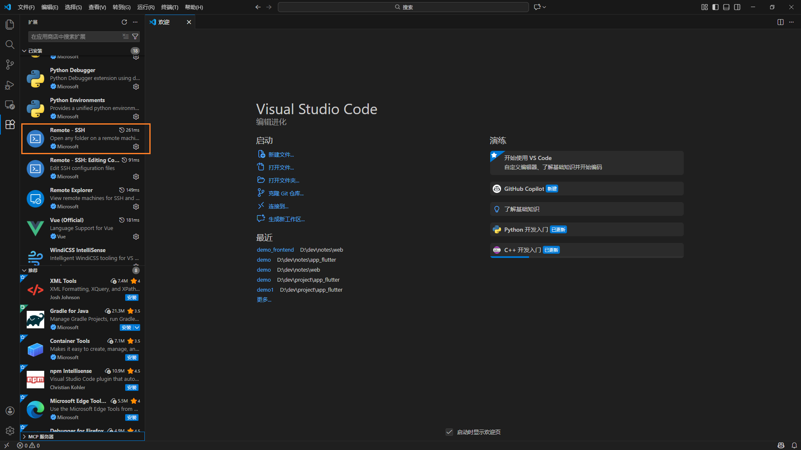

3. 在`VS Code`中通过密码登录远程服务器

   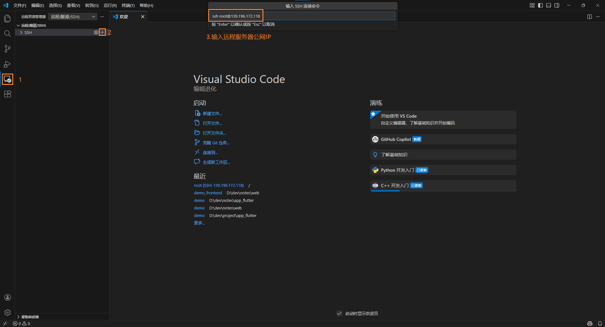

   > 💡填写自己远程服务器的公网IP

   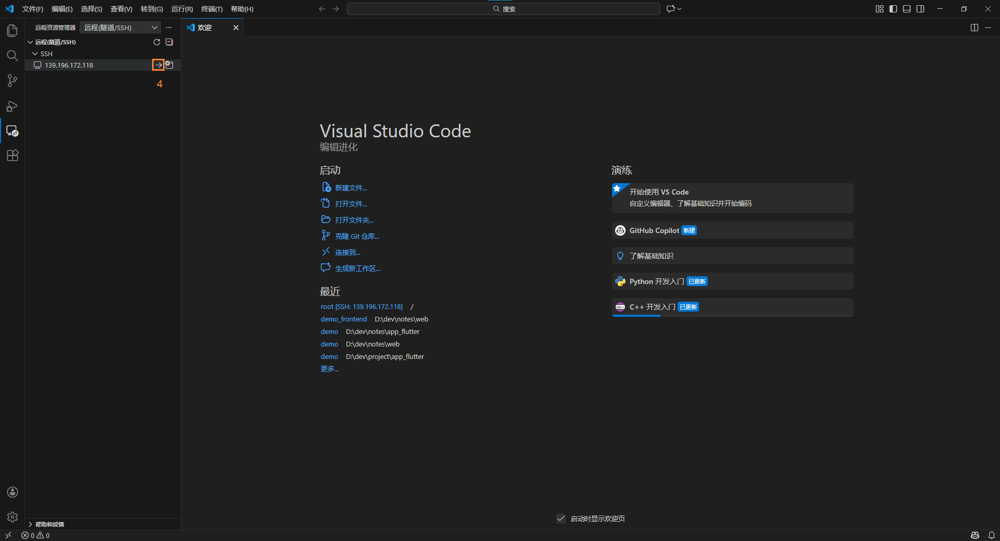

   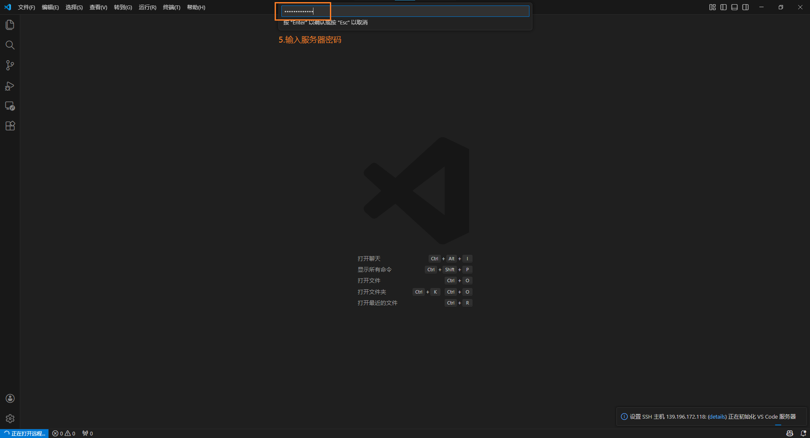

   > ⚠️远程服务器一定要开启密码登录，不然会报错

   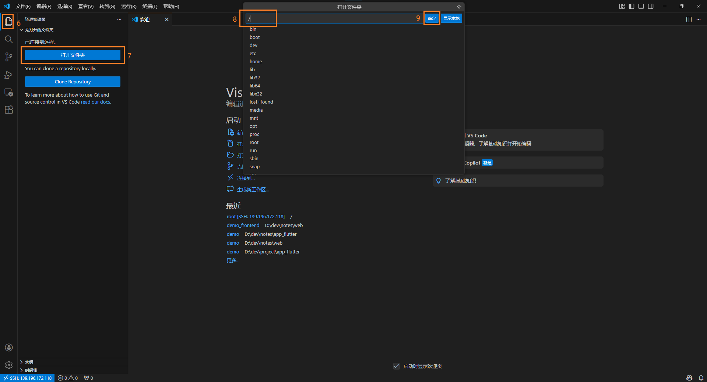

   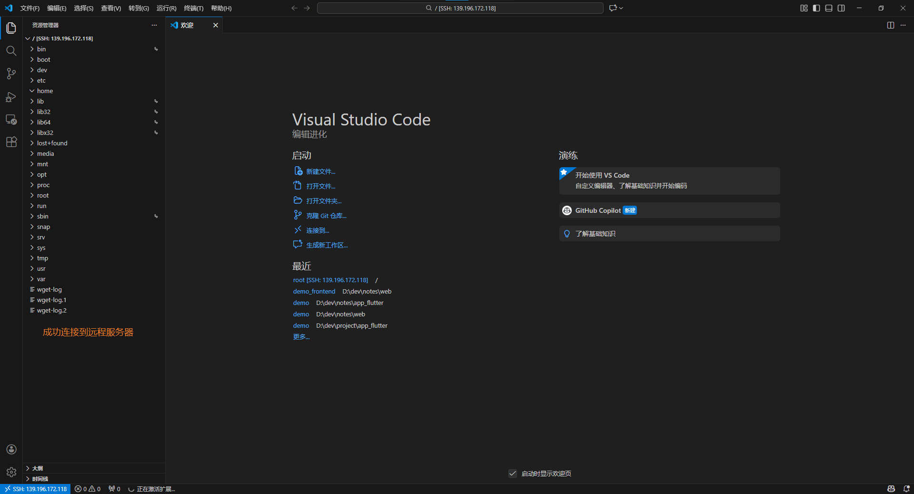

4. 远程服务器设置免密登录

   

   > 💡输入`ssh-keygen -t rsa`之后一路回车即可

   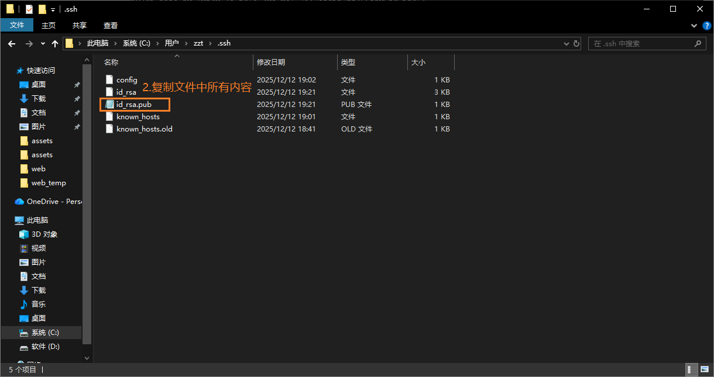

   

   > 💡修改完记得保存，然后重启`VS Code`即可免密登录

### 4.2 准备资源文件

#### 4.2.1 前端文件

1. 创建工作目录`D:\dev\project\web\demo_server\frontend`，并在该目录下创建`nginx.conf`文件，文件内容如下，直接复制黏贴即可

   ```
   #user  nobody;
   worker_processes  1;
   
   #error_log  logs/error.log;
   #error_log  logs/error.log  notice;
   #error_log  logs/error.log  info;
   
   #pid        logs/nginx.pid;
   
   
   events {
       worker_connections  1024;
   }
   
   
   http {
       include       mime.types;
       default_type  application/octet-stream;
   
       #log_format  main  '$remote_addr - $remote_user [$time_local] "$request" '
       #                  '$status $body_bytes_sent "$http_referer" '
       #                  '"$http_user_agent" "$http_x_forwarded_for"';
   
       #access_log  logs/access.log  main;
   
       sendfile        on;
       #tcp_nopush     on;
   
       #keepalive_timeout  0;
       keepalive_timeout  65;
   
       #gzip  on;
   
       server {
           listen       80;
           server_name  localhost;
   
           #access_log  logs/host.access.log  main;
           #前端地址
           location / {
               root   /usr/share/nginx/html;
             #  root  html;
               index  index.html index.htm;
           }   
           # 后端代理地址
           location /api/ {
               proxy_pass         http://backend:8080/;  
           }
   
           #error_page  404              /404.html;
   
           # redirect server error pages to the static page /50x.html
           #
           error_page   500 502 503 504  /50x.html;
           location = /50x.html {
               root   html;
           }
   
           # proxy the PHP scripts to Apache listening on 127.0.0.1:80
           #
           #location ~ \.php$ {
           #    proxy_pass   http://127.0.0.1;
           #}
   
           # pass the PHP scripts to FastCGI server listening on 127.0.0.1:9000
           #
           #location ~ \.php$ {
           #    root           html;
           #    fastcgi_pass   127.0.0.1:9000;
           #    fastcgi_index  index.php;
           #    fastcgi_param  SCRIPT_FILENAME  /scripts$fastcgi_script_name;
           #    include        fastcgi_params;
           #}
   
           # deny access to .htaccess files, if Apache's document root
           # concurs with nginx's one
           #
           #location ~ /\.ht {
           #    deny  all;
           #}
       }
   
   
       # another virtual host using mix of IP-, name-, and port-based configuration
       #
       #server {
       #    listen       8000;
       #    listen       somename:8080;
       #    server_name  somename  alias  another.alias;
   
       #    location / {
       #        root   html;
       #        index  index.html index.htm;
       #    }
       #}
   
   
       # HTTPS server
       #
       #server {
       #    listen       443 ssl;
       #    server_name  localhost;
   
       #    ssl_certificate      cert.pem;
       #    ssl_certificate_key  cert.key;
   
       #    ssl_session_cache    shared:SSL:1m;
       #    ssl_session_timeout  5m;
   
       #    ssl_ciphers  HIGH:!aNULL:!MD5;
       #    ssl_prefer_server_ciphers  on;
   
       #    location / {
       #        root   html;
       #        index  index.html index.htm;
       #    }
       #}
   
   }
   ```

2. 在`VS Code`中打开[2.3小节](#2.3 前后端联调)的前端项目，修改部分代码，然后在终端输入`npm run build`打包项目，生成的文件存放在项目的`dist`文件夹中

   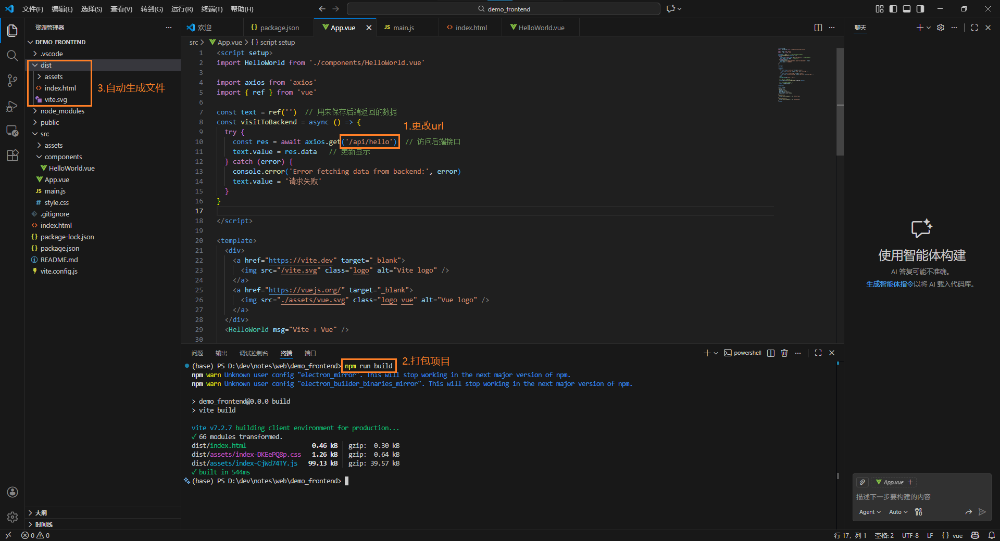

   > 💡执行`axios.get('/api/hello')`后，浏览器会自动追加前端服务器IP和端口，然后发送请求：`http://前端服务器IP:端口/api/hello`

3. 在`frontend`目录中创建`html`文件，并将前面生成的`dist`文件中的所有文件复制到`html`文件中，前端文件目录结构如下：

   > frontend
   > 	├── html
   > 	│   	├── assets
   > 	│   	└── index.html
   > 	│   	└── vite.svg
   > 	└── nginx.conf

#### 4.2.2 后端文件

1. 在`idea`中打开[2.3小节](#2.3 前后端联调)的后端项目，修改部分代码，然后将项目打包成`jar`包

   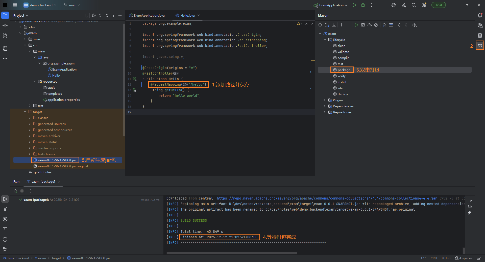

2. 创建工作目录`D:\dev\project\web\demo_server\backend`，复制`jar`包到该目录并重命名为`hello.jar`

3. 在`backend`目录下创建`Dockerfile`文件，文件内容如下，直接复制即可

   ```dockerfile
   # 使用官方 OpenJDK 21 JDK 镜像
   FROM openjdk:latest
   # 设置工作目录
   WORKDIR /app
   
   # 复制你的 jar 包到容器
   COPY hello.jar app.jar
   
   
   # 启动命令
   ENTRYPOINT ["java","-jar","app.jar"]
   
   ```

   > 💡该文件用于构建docker镜像，文件中`hello.jar`注意替换成自己的`jar`包名称，后端文件目录结构如下：
   >
   > backend
   > 	├── hello.jar
   > 	└── Dockerfile

#### 4.2.3 部署文件

在`D:\dev\project\web\demo_server\`目录下创建`docker-compose.yml`文件，用于服务器部署

> ❗文件名字不可修改

```yml
version: "3.9"

#services中的每个服务都会在单独的容器内运行
services:

  #后端服务容器，其他容器可通过容器网络（http://backend:8080/）访问
  backend: 
    #通过后端文件中的Dockerfile构建镜像
    build:
      context: ./backend
      dockerfile: Dockerfile
    #创建容器
    container_name: container_backend
    #端口映射，宿主机的8080端口映射到该容器的8080端口
    ports:
      - "8080:8080"
    #容器网络，网络名称相同的容器可互相通信
    networks:
      - net 
      
  #前端服务容器
  frontend:
    image: nginx
    #创建容器
    container_name: container_frontend
    #端口映射，宿主机的80端口映射到该容器的80端口
    ports:
      - "80:80"
    #数据卷挂载
    volumes:
      #宿主机的./frontend/nginx.conf文件挂载到容器的/etc/nginx/nginx.conf
      - "./frontend/nginx.conf:/etc/nginx/nginx.conf"
      #宿主机的./frontend/html文件挂载到容器的/usr/share/nginx/html
      - "./frontend/html:/usr/share/nginx/html"
    depends_on:
      - backend
     #容器网络，网络名称相同的容器可互相通信
    networks:
      - net
      
#定义容器网络
networks:
  net:
    driver: bridge

```

### 4.3 部署web项目

#### 4.3.1 git安装

通过[1.3小节](#1.3 所需软件)提供的链接下载`git`安装包，并安装至`D:\dev\`目录下，然后在`D:\dev\project\web\demo_server\`目录下打开`git bash`，创建本地仓库

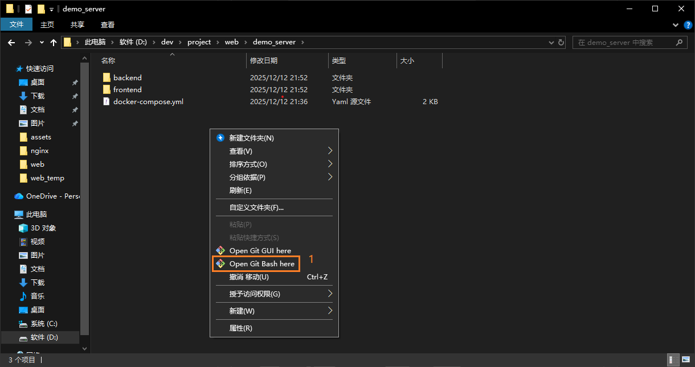

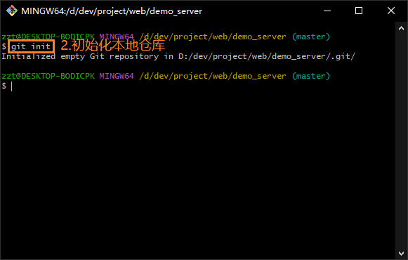

#### 4.3.2 项目上传至gitee

1. 创建`gitee`远程仓库，并获取远程仓库地址`https://gitee.com/gezitii/web.git`

   > 💡仓库名称可自定义

   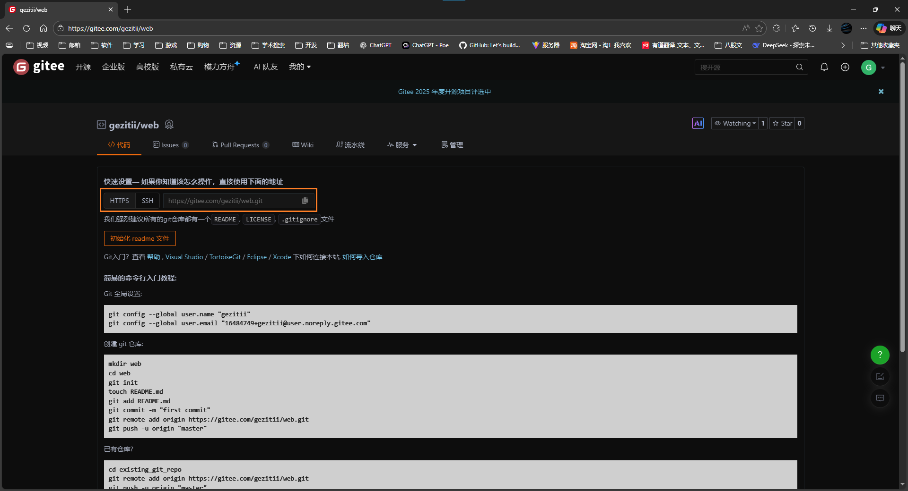

2. 将本地仓库关联到远程仓库

   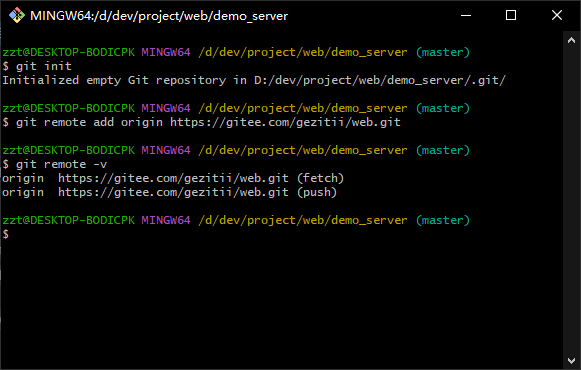

3. 配置用户信息

   

4. 将项目提交到本地仓库

   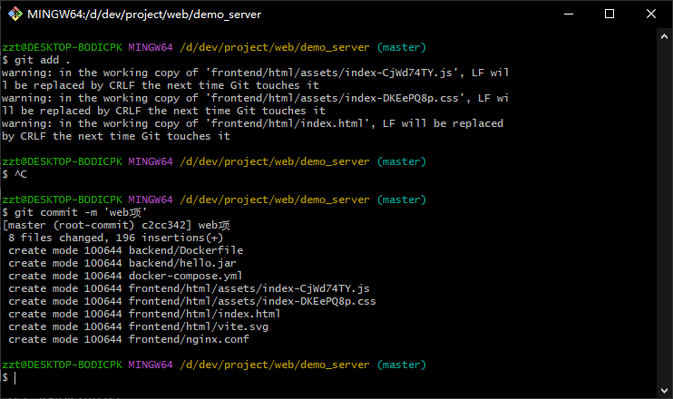

5. 将本地仓库项目推送到远程仓库

   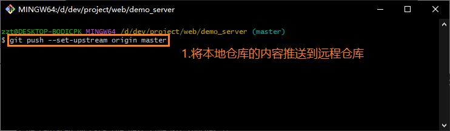

   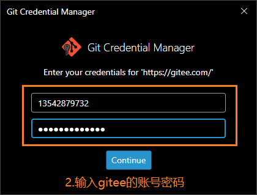

   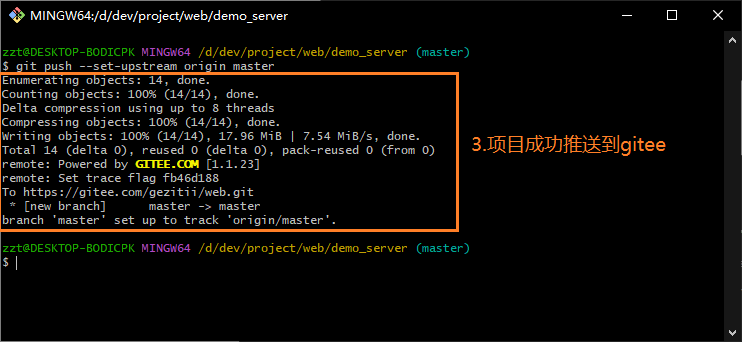

   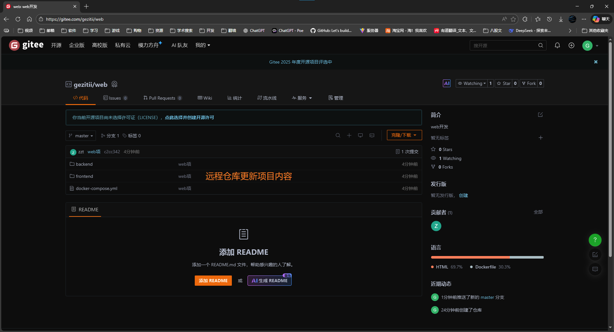

#### 4.3.3 项目部署到远程服务器

1. 通过`VS Code`连接远程主机，创建并进入工作目录`/home/web`，验证`git`版本，并通过`git clone https://gitee.com/gezitii/web.git`拉取项目

   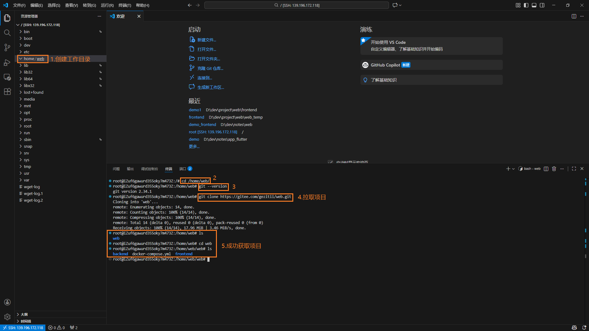

2. 在`VS Code`的终端中按照以下步骤安装`docker`

   ```shell
   #安装前先卸载操作系统默认安装的docker
   sudo apt-get remove docker docker-engine docker.io containerd runc
   #安装必要支持
   sudo apt install apt-transport-https ca-certificates curl software-properties-common gnupg lsb-release
   # 阿里源（推荐使用阿里的gpg KEY）
   curl -fsSL https://mirrors.aliyun.com/docker-ce/linux/ubuntu/gpg | sudo gpg --dearmor -o /usr/share/keyrings/docker-archive-keyring.gpg
   
   #添加 apt 源:
   #Docker官方源
   echo "deb [arch=$(dpkg --print-architecture) signed-by=/usr/share/keyrings/docker-archive-keyring.gpg] https://download.docker.com/linux/ubuntu $(lsb_release -cs) stable" | sudo tee /etc/apt/sources.list.d/docker.list > /dev/null
   
   #阿里apt源
   echo "deb [arch=$(dpkg --print-architecture) signed-by=/usr/share/keyrings/docker-archive-keyring.gpg] https://mirrors.aliyun.com/docker-ce/linux/ubuntu $(lsb_release -cs) stable" | sudo tee /etc/apt/sources.list.d/docker.list > /dev/null
   
   #更新源
   sudo apt update
   
   #安装最新版本的Docker
   sudo apt install docker-ce docker-ce-cli containerd.io
   #等待安装完成
   
   #查看Docker版本
   sudo docker --version
   
   #查看Docker运行状态
   sudo systemctl status docker
   ```

   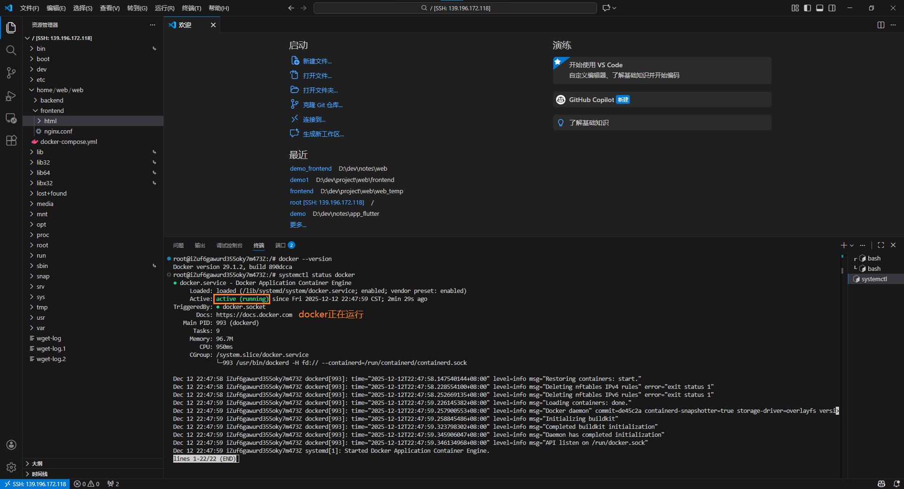

3. 配置`docker`镜像加速

   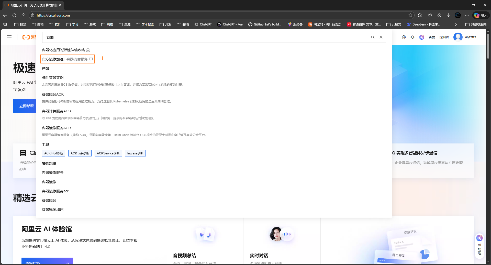

   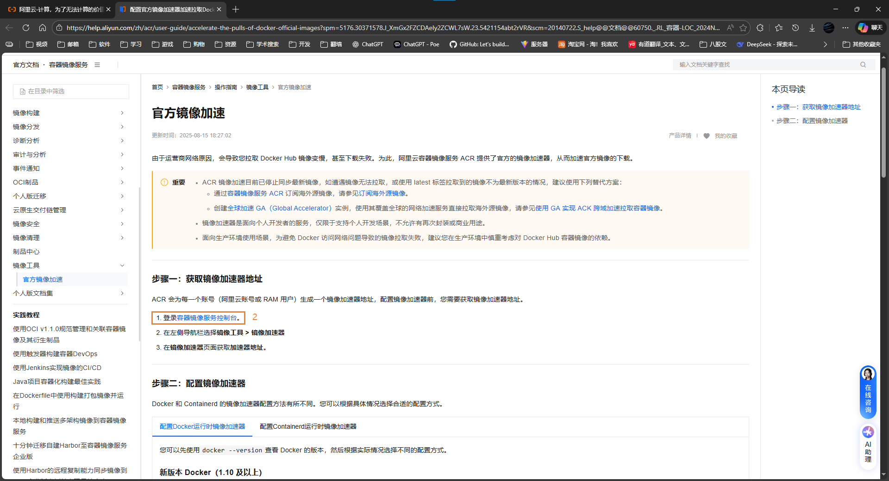

   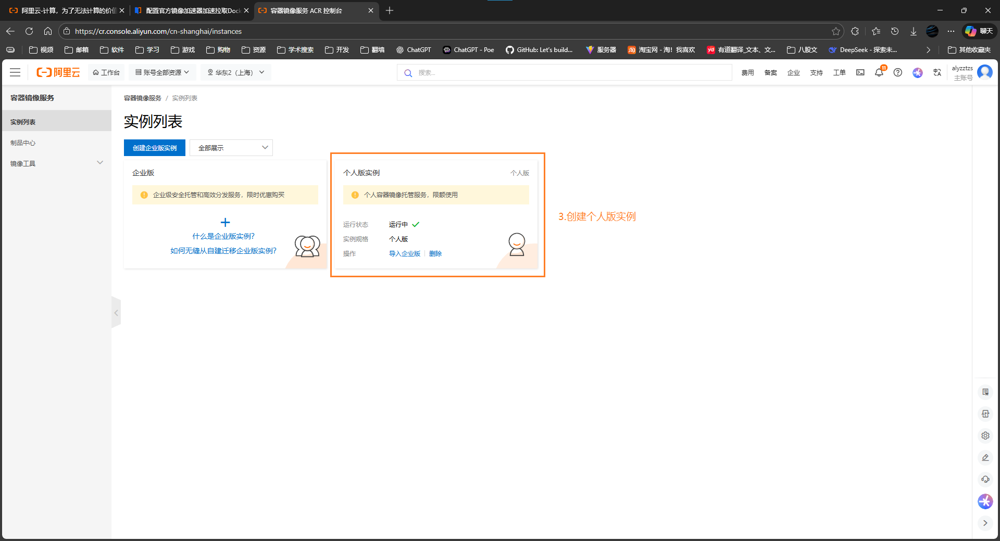

   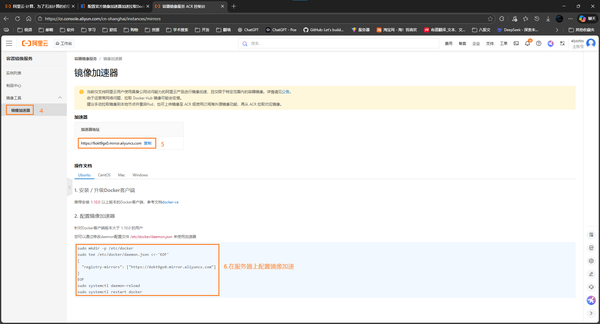

   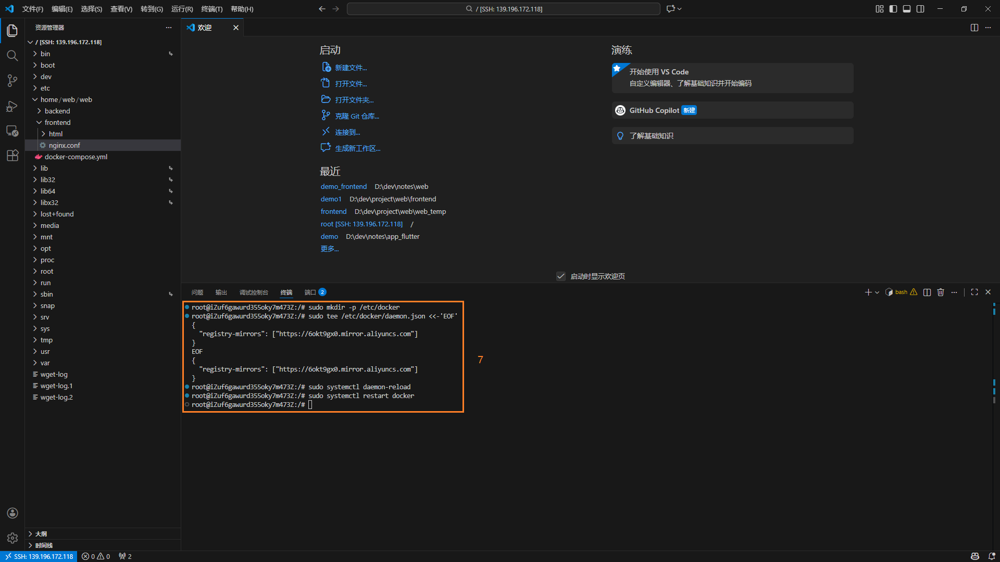

4. 通过`docker`拉取项目运行需要的两个镜像，在终端输入：

   ```shell
   docker pull nginx
   docker pull openjdk
   docker images
   ```

   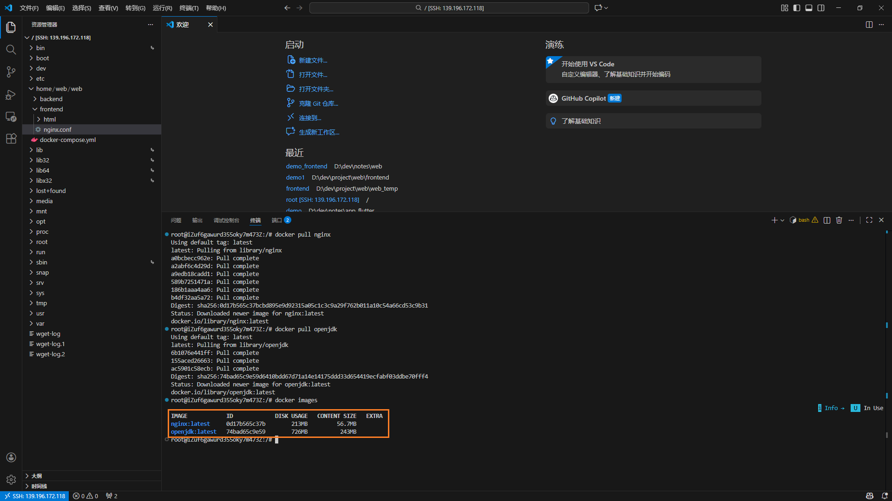

5. 在终端输入`docker compose up -d`一键部署项目

   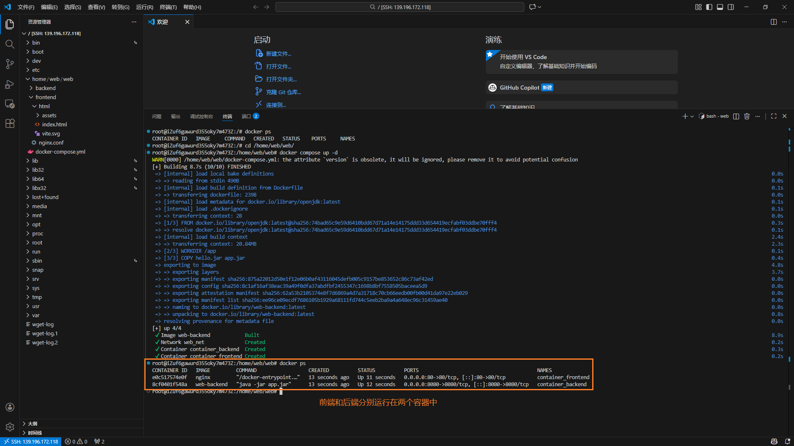

6. 通过浏览器访问远程服务器

   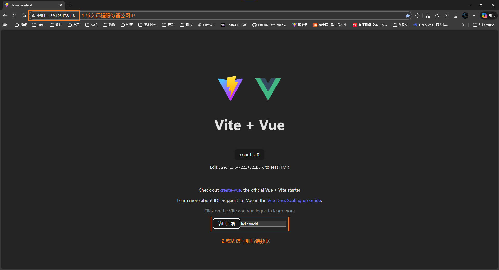

7. 到此，web开发的基本框架已完成，根据需求在[功能开发](#三、功能开发 )中编写业务逻辑代码

   > 💡可以在开发机器上编写功能，然后按照[4.2小节](#4.2 准备资源文件)和[4.3小节](#4.3 部署web项目)的步骤将项目部署到远程主机上

### 4.4 web项目框架图


